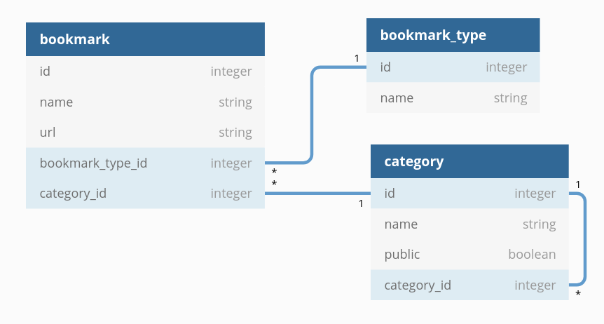

# bookmark manager

Este proyecto es la prueba final del modulo 05 'rails y javascript' de la carrera 'fullstack-g39'.

Se utilizó ruby versión 3.0.0 y rails versión 6.1.3.1.

# Tareas

## 1. Diagrama de relaciones
> Entregar un diagrama de relaciones, de tal manera que explique cómo interactúa cada uno de los modelos.



* Tabla `bookmark_type`: tipos de marcadores (paper, artículo, video, etc.)
* Tabla `category`: categorías
* Tabla `bookmark`: los marcadores, que tienen una categoría y un tipo cada uno

## 2. CRUD
> Entregar un CRUD para la administración de Categorías, Marcador y Tipo.

El CRUD se creó usando el generador de `scaffold` de rails:
```bash
rails g scaffold BookmarkType name
rails g scaffold Category name public:boolean category:belongs_to
rails g scaffold Bookmark name url bookmark_type:belongs_to category:belongs_to
```

## 3. AJAX
> El formulario para agregar Marcadores debe ser enviado a través de una petición AJAX y antes de ser enviado debe pedir confirmación.

### jQuery
Para facilitar un poco las manipulaciones del DOM, agregué `jQuery` usando
```bash
yarn add jquery
```

... y después agregando lo siguiente a `config/webpack/environment.js`:
```js
const webpack = require('webpack')
environment.plugins.prepend('Provide',
  new webpack.ProvidePlugin({
    $: 'jquery/src/jquery',
    jQuery: 'jquery/src/jquery'
  })
)
```

### Vistas
Es necesario hacer unos ajustes a las vistas creadas por el scaffold. Por ejemplo, crear una vista parcial para `bookmark`: `app/views/bookmarks/_bookmark.html.erb`

```erb
<tr id="bookmark-row-<%= bookmark.id %>">
  <td><%= bookmark.name %></td>
  <td><%= bookmark.url %></td>
  <td><%= link_to bookmark.bookmark_type, bookmark.bookmark_type %></td>
  <td><%= link_to bookmark.category, bookmark.category %></td>
  <td><%= link_to 'Show', bookmark, remote: true %></td>
  <td><%= link_to 'Edit', edit_bookmark_path(bookmark), remote: true %></td>
  <td><%= link_to 'Destroy', bookmark, method: :delete, data: { confirm: 'Are you sure?' }, remote: true %></td>
</tr>
```

Importante: agregar el `remote: true` a los links, para que los request se ejecute de forma `js`.

La idea es mostrar el formulario en la misma vista `index` cuando se gatilla la un link para crear o editar un registro. Para lograr esto, hay que crear vistas de tipo javascript para cada acción (extension: `.js.erb`).

### Ejemplo: agregando un nuevo registro
Acá hay dos pasos: la acción `new` muestra el formulario, la acción `create` agrega el nuevo registro a la lista y oculta el formulario de nuevo (todo sin recargar la página).

Se crea un archivo `app/views/bookmarks/new.js.erb`:
```js
// show form
cont = $("#form-container");
cont.hide();
cont.html("<%= escape_javascript(render partial: 'bookmarks/form', locals: { bookmark: @bookmark } ) %>");
cont.slideDown('fast');

// show/hide links
$("#cancel-link").removeClass('hidden');
$("#new-bookmark-link").addClass('hidden');
```

Después, un archivo `app/views/bookmarks/create.js.erb`:
```js
// hide form
cont = $("#form-container");
cont.slideUp('fast');
cont.html();

// show/hide links
$("#cancel-link").addClass('hidden');
$("#new-bookmark-link").removeClass('hidden');

// add new row to table
$("#bookmarks-table").append("<%= escape_javascript(render partial: 'bookmarks/bookmark', locals: { bookmark: @bookmark } ) %>");
```

## 4. JSON endpoint
> Crear un endpoint que retorne un JSON con los datos de una categoría (debe incluir subcategorías y marcadores). El esquema del JSON de salida debe quedar a su criterio.

Con el scaffold, ya existe la posibilidad de obtener un json por las rutas que se agrega automáticamente mediante el `resources`:

Esta línea en `routes.rb`
```ruby
resources :categories
```
crea, entre otros, esta ruta:
```
PREFIX      VERB   URI Pattern                  Controller#Action
category    GET    /categories/:id(.:format)    categories#show
```

Por ejemplo, la siguiente URL ya entrega una categoría en el formato JSON:
```
/categories/5.json
```

Sólo hay que cambiar el contenido del JSON para que incluya también las categorías subordenadas y los detalles de los bookmarks asociados. Por eso, yo definí primero un methodo `to_json` en la clase `Bookmark`:

```ruby
def to_json
  {
    name: name,
    url: url,
    type: bookmark_type.to_s
  }
end
```

También en la clase `Category`:

```ruby
def to_json
  json = {
    name: name,
    public: public,
    parent_category: parent_category.to_s
  }

  json['bookmarks'] = []
  bookmarks.each do |b|
    json['bookmarks'] << b.to_json
  end

  json
end
```

Ojo que acá ya se agrega los detalles de los bookmarks asociados, usando el mísmo método `to_json` creado antes. Ahora todo lo que falta es agregar las categorías subordenadas a cada categoría. Eso se hace en el método `category_deep_hash` en el controlador `CategoriesController`:

```ruby
def category_deep_hash(category)
  hash = category.to_json
  hash['children'] = []
  category.child_categories.each do |c|
    hash['children'] << category_deep_hash(c)
  end
  hash
end
```

Es una función recursiva, es decir que recorre todas las subcategorías de la categoría actual y llama la misma función para cada una. Eso se repite hasta que una categoría no tenga más subcategorías. El paso final es llamar este método en la acción show:

```ruby
def show
  respond_to do |format|
    format.json { render json: category_deep_hash(@category) }
    format.html
  end
end
```

## 5. Seed
> Inicialmente, nuestro sistema debe contener al menos 20 registros predefinidos.

En la generación del seed estoy ocupando la gema `faker` para crear categorías y URLs al azar. El siguiente es el archivo `seeds.rb`:

```ruby
require 'faker'

## clean DB
Bookmark.delete_all
Category.delete_all
BookmarkType.delete_all

## Categories
10.times do
  Category.create!(name: Faker::Hipster.word, public: Faker::Boolean.boolean, parent_category: Category.all.sample)
end

## Bookmark types
BookmarkType.create!(name: 'Video')
BookmarkType.create!(name: 'Article')
BookmarkType.create!(name: 'Paper')
BookmarkType.create!(name: 'Interview')
BookmarkType.create!(name: 'Audio')
BookmarkType.create!(name: 'Other')

## Bookmarks
50.times do
  Bookmark.create(name: Faker::Lorem.words(number: 3).join(' '), url: Faker::Internet.url, bookmark_type: BookmarkType.all.sample, category: Category.all.sample)
end
```

Se ejecuta el seed llamando `rails db:seed` desde la consola.

## 6. Gráfico
> Mostrar un gráfico de torta que muestre cómo están distribuidos los tipos de marcadores.

Para hacer el gráfico, uso la gema `chartkick` (https://chartkick.com). El uso de la gema es bien fácil, para dibujar un gráfico de torta es suficiente poner una línea en la vista:

```ruby
<%= pie_chart bookmark_cnt_per_type %>
```

Sin obstante, la generación de los datos generó un problema. El `pie_chart` necesita un hash, donde el `key` es el nombre de la serie y el `value` es el valor (la cantidad de bookmarks en este caso).
Se puede obtener la cantidad con lo siguiente:
```ruby
Bookmark.group(:bookmark_type).count
```
Pero eso resulta en un hash donde el key es un objeto de la clase `BookmarkType` y eso no se mostró correctamente en el gráfico. Así que creé un método en el `BookmarkTypesHelper` que cambia el key por el simple nombre del tipo:

```ruby
def bookmark_cnt_per_type
  hash = Bookmark.group(:bookmark_type).count
  keys = hash.keys.map(&:name)
  [keys, hash.values].transpose.to_h
end
```
